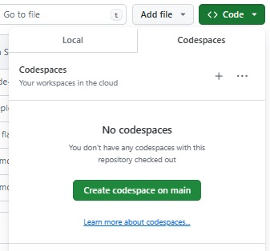
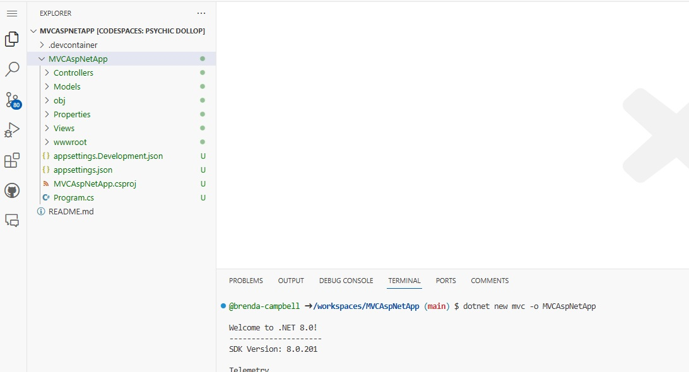
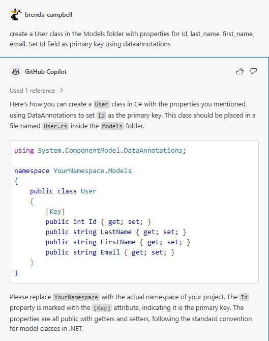

# Creating a ASP.NET MVC application to deploy to Azure App Service

This is an ASP.NET MVC application that uses Entity Framework Core for data access.

## Project Setup

Here are the steps to create the project and install dependencies (using either GitHub Codespace or VS Code):

1. **Open Codespace** Select the green code button in the repo and switch to the 'Codespaces' tab. Click on the 'Create codespace on main' button.



The codespace will open and the extensions that are referenced in the devcontainer.json file will be loaded, i.e. GitHub Copilot and GitHub Copilot Chat. 

2. **Open the terminal window** Select the 3 horizonal lines at the top left of the codespace and open a new terminal window. This may also be under the top view menu. 


3. **Create the ASP.NET MVC project**
    Create a new ASP.NET MVC project named `MVCAspNetApp` [Replace this with your preferred name] using the .NET CLI with the following command:

    ```bash
    dotnet new mvc -o MVCAspNetApp
    ```
This will create a folder structure as shown:



4. **Navigate to the project directory** Navigate into the newly created project directory:
```bash
cd MVCAspNetApp
```

5. **Install the EF Core CLI** Install the Entity Framework Core command-line interface:
```bash
dotnet tool install --global dotnet-ef
```

6. **Add Entity Framework Core** Add the Entity Framework Core package to your project:
```bash
dotnet add package Microsoft.EntityFrameworkCore
```

7. **Add Entity Framework Core SQLServer** Add the Entity Framework Core SqlServer package to your project:
```bash
dotnet add package Microsoft.EntityFrameworkCore.SqlServer
```

8. **Add Entity Framework Core Tools** Add the Entity Framework Core Tools package to your project:
```bash
dotnet add package Microsoft.EntityFrameworkCore.Tools
```

9. **Update the appsettings.json file** Add your connection string to the appsettings.json file:
```bash
"ConnectionStrings": {
    "DefaultConnection": "Your_Connection_String_Here"
}
```

To get the connection string, you must have completed the deployment as described in https://github.com/hackathon-white-camel-26/deployAzureResources. Once you have executed the workflow, the SQL Server and Database will be available in yout Azure portal (https://portal.azure.com/).

Navigate to the resource group that was created and select the SQL database


Select Connection Strings under Settings and copy the value of the string:


Paste this value into the appsettings.json file as the value for 'DefaultConnection'. Ensure that you update the value of the password. 


10. **Create the models** 

**Create a `User` class.** Ask GitHub Copilot Chat to 'create a User class in the Models folder with properties for Id, last_name, first_name, email. Set Id field as primary key using dataannotations'



Select the three dots above the generate code and insert into a new file


Replace the value for 'YourNamespace' with the correct value based on your project name, i.e. MVCAspNetApp.Models. Save the file into the Models folder as User.cs


**Create a `Quiz` class.** Ask GitHub Copilot Chat to 'create a Quiz class with properties for Id, title using dataannotations and ID is primary key'.

Select the three dots above the generate code and insert into a new file.

If needed, replace the value for 'YourNamespace' with the correct value based on your project name, i.e. MVCAspNetApp.Models. You may notice that GitHub Copilot starts to follow the pattern and is using the correct namespace. Save the file into the Models folder as Quiz.cs

**Create a `QuizQuestion` class** Ask GitHub Copilot Chat 'create a QuizQuestion class to with properties for Id, QuizId, text using dataannotations where Id is primary key and QuizId is foreign key'

Select the three dots above the generate code and insert into a new file.

Save the file into the Models folder as QuizQuestion.cs

**Create a `QuizQuestionOption` class** Ask GitHub Copilot Chat 'create a QuizQuestionOption class to with properties for Id, QuizQuestion_Id, text, is_correct where Id is primary key and QuizQuestion_Id is foreign key'.
Note that I am not referencing dataannotations anymore as GitHub Copilot is using the context of what I am doing. 

Select the three dots above the generate code and insert into a new file.

Save the file into the Models folder as QuizQuestionOption.cs

**Create a `QuizUserAnswer` class** Ask GitHub Copilot Chat 'create a QuizUserAnswer class to with properties for Id, QuizQuestionId, QuizQuestionOption_id

Select the three dots above the generate code and insert into a new file.

Save the file into the Models folder as QuizUserAnswer.cs

Your models folder should contain 5 new classes as shown:


11. **Create the ApplicationDbContext class** Create an `ApplicationDbContext` class in the Data folder. This class is used to interact with the database using Entity Framework Core. 
Create a new folder called 'Data' 
Ask GitHub Copilot Chat 'create a ApplicationDBContext  class to with properties for Id, QuizQuestionId, QuizQuestionOption_id


6. **Update the Program.cs file** Update the Program.cs file to use the connection string from the appsettings.json file.

```bash
builder.Services.AddDbContext<ApplicationDbContext>(options => options.UseSqlServer(builder.Configuration.GetConnectionString("DefaultConnection")));
```


9. **Update the HomeController** Update the `HomeController` in the Controllers folder to handle HTTP requests and responses.

10. **Update the Views** Update the views in the Views folder to display data to the user.

11. **Create the initial database migration** Create the initial database migration:
```bash
dotnet ef migrations add InitialCreate
```

12. **Update the database** Update the database to apply the migration:
```bash
dotnet ef database update
```

## Troubleshooting
If you encounter an error like "Cannot open server 'evketek6-sql' requested by the login. Client with IP address '51.140.125.85' is not allowed to access the server", you need to create a firewall rule in the Azure portal to allow your IP address to access the server.


## Running the Project
To run the project, use the following command in the terminal:
```bash
dotnet run
```
This will start the application and it will be accessible at `http://localhost:5000`.
